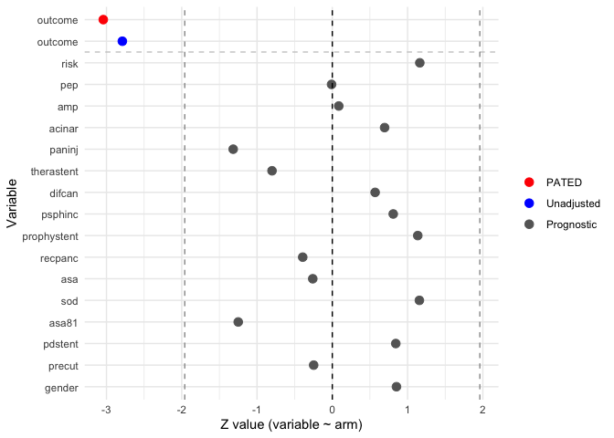

<!-- README.md is generated from README.Rmd. Please edit that file -->

# multipleOutcomes

<!-- badges: start -->

[](https://www.repostatus.org/#active)
<!-- badges: end -->

The goal of multipleOutcomes is to fit statistical models for multiple
outcomes simultaneously. It computes estimates of parameters across
fitted models and returns the matrix of asymptotic covariance. Various
applications of this package, including PATED (Prognostic Variables
Assisted Treatment Effect Detection), multiple comparison adjustment,
conditional power are illustrated.

## Installation

You can install the development version of multipleOutcomes from
[GitHub](https://github.com/) with:

``` r
if (!require("remotes")) {
  install.packages("remotes")
}
remotes::install_github(
  "zhangh12/multipleOutcomes", 
  build_manual = TRUE, 
  force = TRUE
)
```

## Example

Let’s get started by analyzing a real randomized trial data. The data
was from a randomized clinical trial of indomethacin to prevent
post-ERCP pancreatitis. The binary endpoint is post-ERCP pancreatitis
(yes/no). It was collected, reformatted and shared by Dr. Peter Higgins
in his R package
[`medicaldata`](https://cloud.r-project.org/web/packages/medicaldata/index.html).
For more information, please refer to the data set `indo_rct` in
`medicaldata`, and the
[manuscript](https://www.nejm.org/doi/full/10.1056/NEJMoa1111103).

Here we use the PATED method to estimate marginal treatment effect on
post-ERCP pancreatitis, adjusting for a set of risk factors for PEP as
potential prognostic covariates. I am not an expert of this disease, so
I simply follow the description information of the covariates in
`medicaldata`.

Here we compare PATED with unconditional logistic regression model in
estimating the treatment effect. For each of the covariates, a
regression model `covar ~ rx` is fitted to compute the slope coefficient
$\hat b$. The correlation between $\hat b$ and $\hat\beta$, the
unadjusted estimate of treatment effect (`outcome ~ rx`), are computed
in the column `corr`.

``` r
library(multipleOutcomes)

options(digits = 4)

data(indo)

fit <- pated(
  outcome ~ rx, 
  
  risk ~ rx, 
  gender ~ rx, 
  sod ~ rx, 
  pep ~ rx,
  recpanc ~ rx,
  psphinc ~ rx, 
  precut ~ rx, 
  difcan ~ rx,  
  amp ~ rx, 
  paninj ~ rx, 
  acinar ~ rx,
  asa81 ~ rx, 
  asa ~ rx,
  prophystent ~ rx, 
  therastent ~ rx, 
  pdstent ~ rx, 
  
  data = indo,
  family = c('binomial', 
             rep('gaussian', 1), 
             rep('binomial', 15))
)

plot(fit)
```



The plot above shows that all covariates are very well balanced between
two arms (i.e. z-values of grey points are close to zero).

``` r
print(fit)
#>           term   family  estimate  stderr   pvalue     method      corr
#> 1      outcome    PATED -0.751357 0.24697 0.002348      PATED        NA
#> 2      outcome binomial -0.705130 0.25283 0.005287   Standard  1.000000
#> 3         risk gaussian  0.083338 0.07168 0.244984 Prognostic  0.139678
#> 4          pep binomial -0.002142 0.22269 0.992326 Prognostic  0.126343
#> 5          amp binomial  0.041102 0.47862 0.931565 Prognostic  0.082925
#> 6       acinar binomial  0.275329 0.39618 0.487084 Prognostic  0.057366
#> 7       paninj binomial -0.360946 0.27417 0.188011 Prognostic  0.053484
#> 8   therastent binomial -0.252931 0.31591 0.423343 Prognostic -0.049425
#> 9       difcan binomial  0.105662 0.18570 0.569368 Prognostic  0.048068
#> 10     psphinc binomial  0.133453 0.16480 0.418059 Prognostic  0.037479
#> 11 prophystent binomial  0.215272 0.18961 0.256226 Prognostic  0.034128
#> 12     recpanc binomial -0.069990 0.17817 0.694454 Prognostic  0.033145
#> 13         asa binomial -0.072330 0.27877 0.795278 Prognostic -0.024236
#> 14         sod binomial  0.248237 0.21453 0.247228 Prognostic -0.010506
#> 15       asa81 binomial -0.394693 0.31587 0.211467 Prognostic -0.007874
#> 16     pdstent binomial  0.181177 0.21480 0.398967 Prognostic  0.006305
#> 17      precut binomial -0.090072 0.36402 0.804570 Prognostic  0.005952
#> 18      gender binomial  0.170977 0.20058 0.393994 Prognostic  0.004055
```

It is evident that PATED produces a treatment effect estimate (-0.7514)
that is close to the one from the unconditional logistic regression
model (-0.7051), indicating a good property of unbiasness. Meanwhile, a
slightly lower SE (0.247 v.s. 0.2528) and more significant p-value
(0.0023 v.s. 0.0053) are obtained by PATED.

In comparison, we adjust the list of covariates in a logistic regression
to estimate conditional log odds ratio of treatment. We have to exclude
`asa81` and `asa` due to missing data, and `prophystent`, `therastent`
and `pdstent` due to numerical instability.

``` r
logit <- glm(
  outcome ~ rx + risk + gender + sod + pep + recpanc + psphinc + precut + difcan + amp + paninj + acinar, 
  family = 'binomial', data = indo
) |> summary()

logit
#> 
#> Call:
#> glm(formula = outcome ~ rx + risk + gender + sod + pep + recpanc + 
#>     psphinc + precut + difcan + amp + paninj + acinar, family = "binomial", 
#>     data = indo)
#> 
#> Coefficients:
#>              Estimate Std. Error z value Pr(>|z|)    
#> (Intercept)  -2.78401    0.47052   -5.92  3.3e-09 ***
#> rx           -0.80110    0.26337   -3.04   0.0024 ** 
#> risk          0.15917    0.54108    0.29   0.7686    
#> gender2_male -0.00483    0.35756   -0.01   0.9892    
#> sod1_yes      0.33084    0.72780    0.45   0.6494    
#> pep1_yes      0.98179    0.63710    1.54   0.1233    
#> recpanc1_yes  0.01492    0.38860    0.04   0.9694    
#> psphinc1_yes  0.11582    0.59986    0.19   0.8469    
#> precut1_yes   0.20988    0.75567    0.28   0.7812    
#> difcan1_yes   0.41110    0.61653    0.67   0.5049    
#> amp1_yes      1.92303    0.85627    2.25   0.0247 *  
#> paninj1_yes   0.16629    0.47729    0.35   0.7275    
#> acinar1_yes   0.98954    0.61083    1.62   0.1052    
#> ---
#> Signif. codes:  0 '***' 0.001 '**' 0.01 '*' 0.05 '.' 0.1 ' ' 1
#> 
#> (Dispersion parameter for binomial family taken to be 1)
#> 
#>     Null deviance: 468.01  on 601  degrees of freedom
#> Residual deviance: 433.43  on 589  degrees of freedom
#> AIC: 459.4
#> 
#> Number of Fisher Scoring iterations: 5
```

The conditional treatment effect is estimated as -0.8011, with SE 0.2634
and p-value 0.0024.

In this example, it seems like using unconditional logistic regression
or PATED can underestimate treatment effect compared to regression
adjustment. However, this is not always the case in practice. We also
see examples where the regression adjustment can underestimate the
treatment effect substantially. In fact, such a comparison is invalid
because they are estimating different parameters under different
definitions of treatment effect. In terms of statistical power of
detecting treatment effect, comprehensive simulation studies show that
PATED always outperform unconditional logistic regression, and is
comparable to (if not better than) regression adjustment.
