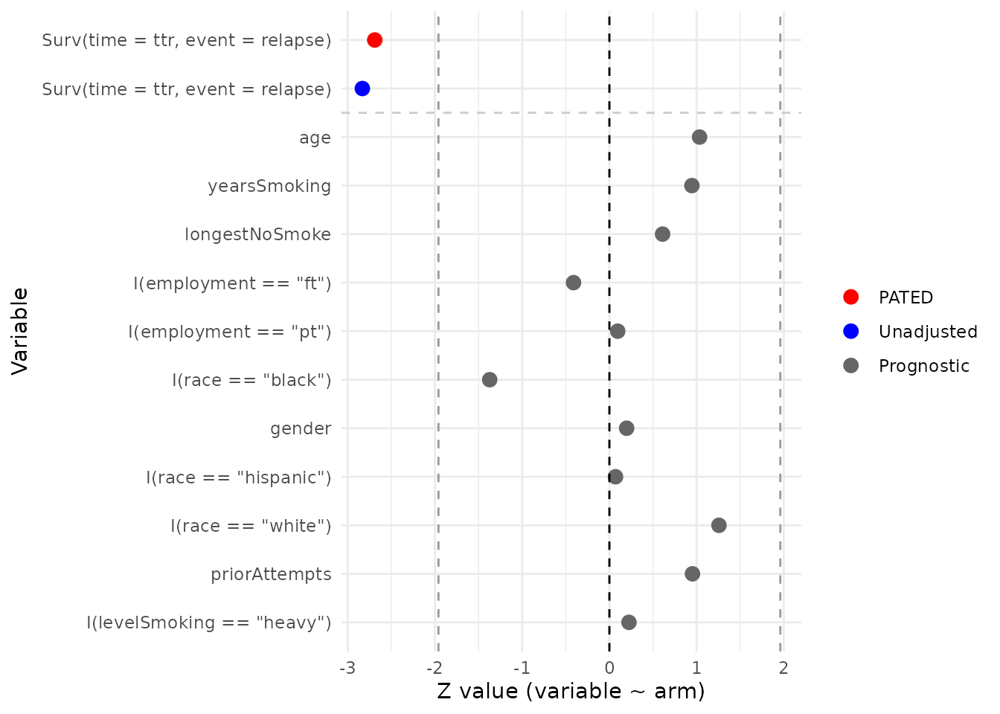
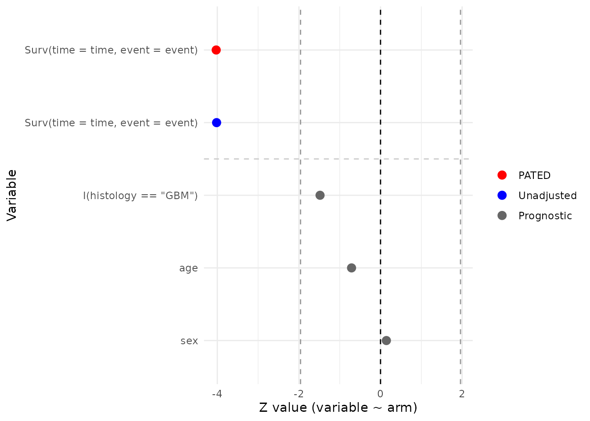
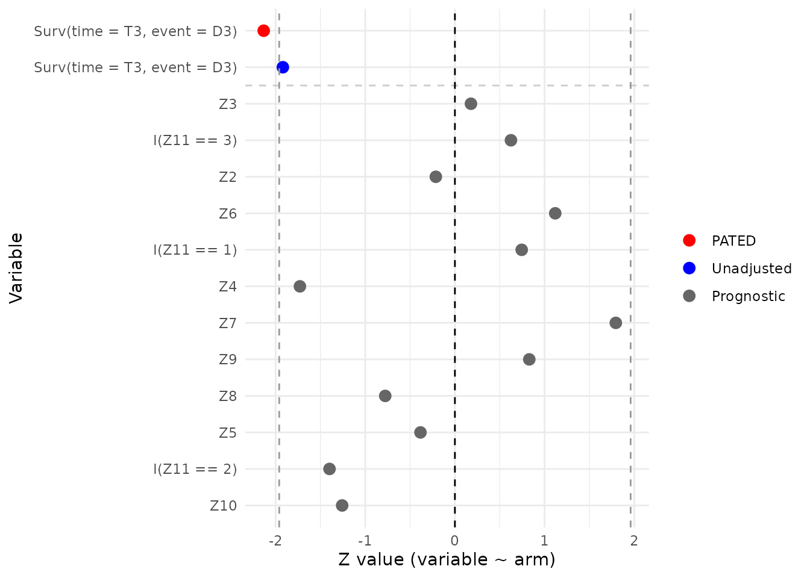
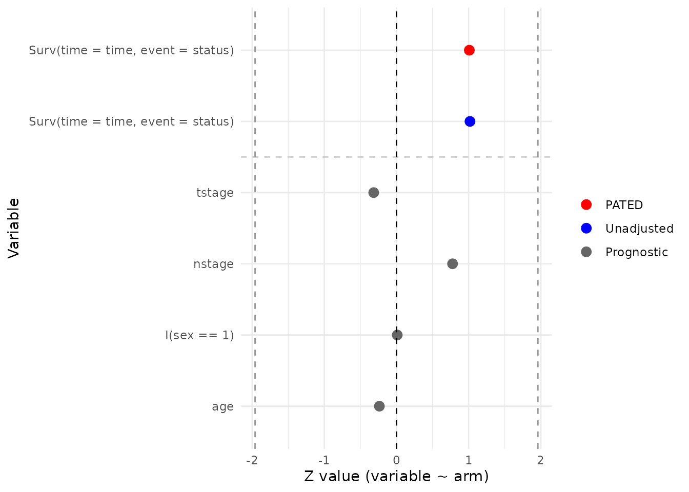
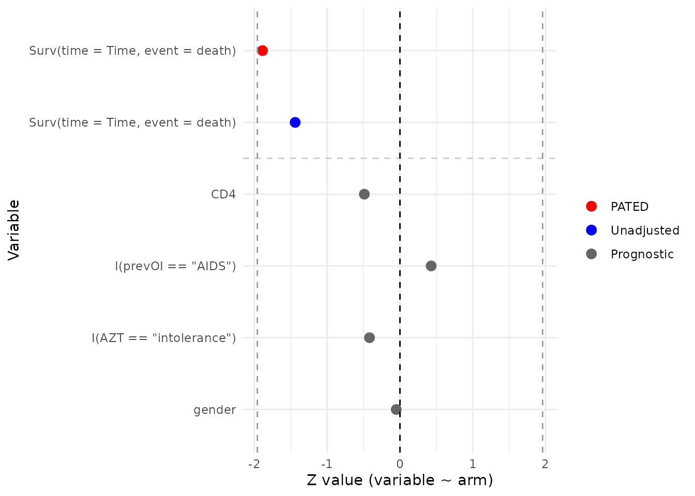
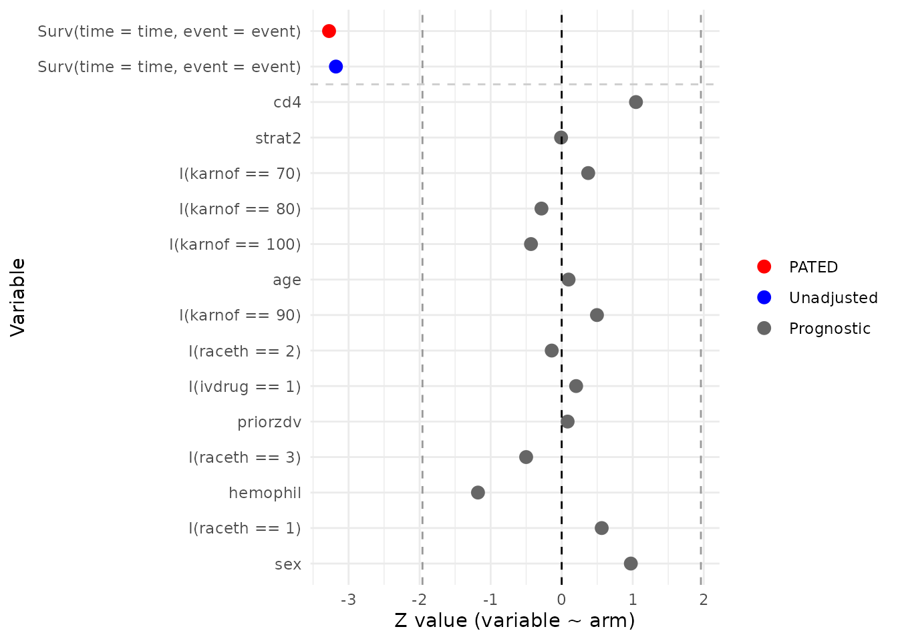
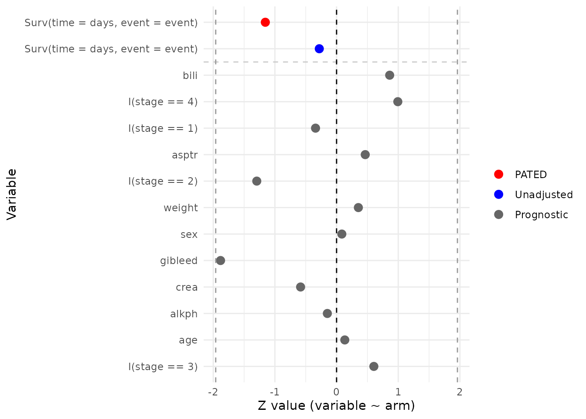
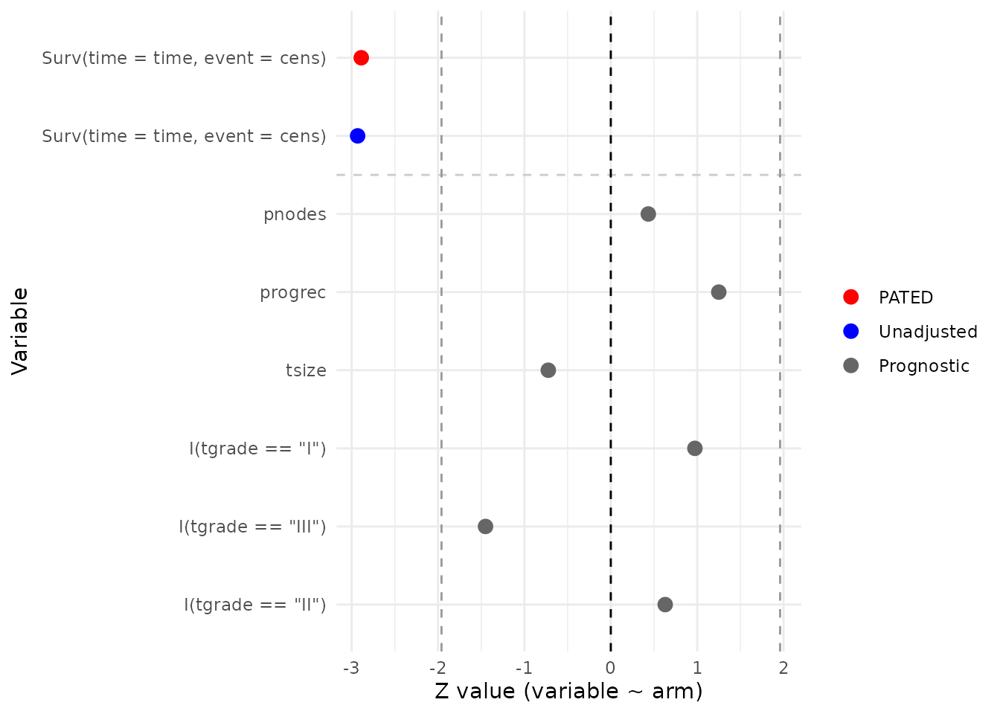

# PATED: Prognostic-Assisted Treatment Effect Detection in Randomized Trials

## Overview

In a properly randomized clinical trial, baseline covariates are
balanced between treatment arms *in expectation*. PATED
(Prognostic-Assisted Treatment Effect Detection) exploits that fact: by
jointly modelling the primary endpoint together with a panel of
prognostic baseline covariates and accounting for their joint
covariance, the estimated treatment effect on the primary endpoint can
be adjusted to remove chance imbalance, shrinking its standard error
without introducing bias.

[`pated()`](https://zhangh12.github.io/multipleOutcomes/reference/pated.md)
returns a data frame with one row per term. The first two rows are the
adjusted (`method = "PATED"`) and unadjusted (`method = "Standard"`)
estimates of the primary treatment effect, each with its standard error
and p-value. The remaining rows hold the per-arm regression of each
prognostic covariate on the treatment indicator
(`method = "Prognostic"`), again with estimates, standard errors,
p-values, and the estimated correlation with the primary endpoint. The
function does not report a Wald statistic or relative efficiency
directly; those are simple derived quantities and we compute them inside
this vignette via a small helper.

This vignette walks through eight publicly available randomized trial
datasets distributed in CRAN packages. Each example fits a Cox model for
the primary time-to-event endpoint together with GLMs for the baseline
covariates, all sharing the treatment indicator. Datasets that bundle
disparate cohorts or that originate from observational studies are
deliberately excluded so that the randomization assumption underlying
PATED is satisfied.

### Reading the diagnostic plot

Diagnosis is delivered through the
[`plot()`](https://rdrr.io/r/graphics/plot.default.html) method, which
converts each row of the `pated` object into a Wald z-statistic
(`estimate / stderr`) and arranges them on a forest-style chart:

- The **red** point at the top is the PATED-adjusted z for the primary
  endpoint.
- The **blue** point just below is the *unadjusted* z for the same
  endpoint.
- The **gray** points are the per-arm z-statistics for each baseline
  covariate (`covariate ~ arm`), ordered by their estimated correlation
  with the primary outcome (strongest at the top).

Dashed vertical lines mark `z = 0` and `z = +/-1.96`. Two things to look
for:

1.  **Baseline balance.** Under randomization the gray prognostic points
    should scatter around zero with only a few drifting past `+/-1.96`
    by chance. A systematic shift to one side, or many covariates
    outside the +/-1.96 band, suggests imbalance worth investigating
    before relying on the adjusted estimate.
2.  **Power gain.** PATED removes the component of the primary effect
    that is explained by chance baseline imbalance. When the red PATED
    point sits noticeably further from zero than the blue unadjusted
    point, the prognostic panel has shaved variance off the primary
    estimate; when red and blue nearly coincide, the covariates added
    little.

### Relative efficiency helper

Relative efficiency (RE) of PATED over the unadjusted analysis is the
ratio of their sampling variances. We compute it from the two
treatment-effect rows of the `pated` return:

``` math
\text{RE} = \left(\frac{\text{stderr}_\text{Standard}}{\text{stderr}_\text{PATED}}\right)^2
```

A value larger than 1 means PATED produced a tighter standard error than
the unadjusted analysis on the same data.

``` r

library(multipleOutcomes)
library(dplyr)
library(survival)
options(digits = 2)

# pated() requires a subject identifier; add one if the data lack it.
add_pid <- function(df) {
  df$pid <- paste0("s-", seq_len(nrow(df)))
  df
}

# Derive RE from the two primary-effect rows that pated() returns.
relativeEfficiency <- function(obj){
  adj   <- obj[obj$method == 'PATED',    'stderr']
  unadj <- obj[obj$method == 'Standard', 'stderr']
  (unadj / adj)^2
}

printObject <- function(obj){
  message(gsub('_', '::', deparse(substitute(obj))))
  message(paste0('Relative Efficiency: ',
                 format(relativeEfficiency(obj), digits = 3)))
  print(obj)
}
```

## Smoking cessation: `asaur::pharmacoSmoking`

Steinberg et al. (2009) randomized 125 smokers (61 combination, 64
patch-only) to a triple-medication “combination” arm (nicotine patch
plus bupropion plus a nicotine lozenge) or to a patch-only arm. The
primary endpoint is time to relapse (`ttr`/`relapse`); baseline
covariates include age, smoking history, prior cessation attempts,
gender, race, employment status, and a smoking intensity score.

``` r

data(pharmacoSmoking, package = 'asaur')

asaur_pharmacoSmoking <-
  pated(
    coxph_(Surv(time = ttr, event = relapse) ~ grp,           data_index = 1),
    glm_(age            ~ grp, family = "gaussian",           data_index = 1),
    glm_(yearsSmoking   ~ grp, family = "gaussian",           data_index = 1),
    glm_(priorAttempts  ~ grp, family = "gaussian",           data_index = 1),
    glm_(longestNoSmoke ~ grp, family = "gaussian",           data_index = 1),
    glm_(gender         ~ grp, family = "binomial",           data_index = 1),
    glm_(I(race == 'black')        ~ grp, family = "binomial", data_index = 1),
    glm_(I(race == 'hispanic')     ~ grp, family = "binomial", data_index = 1),
    glm_(I(race == 'white')        ~ grp, family = "binomial", data_index = 1),
    glm_(I(employment == 'ft')     ~ grp, family = "binomial", data_index = 1),
    glm_(I(employment == 'pt')     ~ grp, family = "binomial", data_index = 1),
    glm_(I(levelSmoking == 'heavy')~ grp, family = "binomial", data_index = 1),
    data = list(add_pid(pharmacoSmoking %>%
                          mutate(grp = ifelse(grp == 'combination', 1, 0))))
  )

printObject(asaur_pharmacoSmoking)
#>                                 term family estimate stderr pvalue     method
#> 1  Surv(time = ttr, event = relapse)  PATED   -0.538   0.20 0.0071      PATED
#> 2  Surv(time = ttr, event = relapse)  coxph   -0.605   0.21 0.0046   Standard
#> 3                                age    glm    2.170   2.10 0.3011 Prognostic
#> 4                       yearsSmoking    glm    1.963   2.08 0.3442 Prognostic
#> 5                     longestNoSmoke    glm  116.806 191.48 0.5419 Prognostic
#> 6              I(employment == "ft")    glm   -0.149   0.36 0.6809 Prognostic
#> 7              I(employment == "pt")    glm    0.054   0.57 0.9241 Prognostic
#> 8                 I(race == "black")    glm   -0.543   0.40 0.1700 Prognostic
#> 9                             gender    glm    0.074   0.37 0.8432 Prognostic
#> 10             I(race == "hispanic")    glm    0.051   0.73 0.9441 Prognostic
#> 11                I(race == "white")    glm    0.467   0.37 0.2090 Prognostic
#> 12                     priorAttempts    glm   15.514  16.28 0.3406 Prognostic
#> 13        I(levelSmoking == "heavy")    glm    0.089   0.40 0.8224 Prognostic
#>       corr
#> 1       NA
#> 2   1.0000
#> 3  -0.2144
#> 4  -0.1494
#> 5  -0.1463
#> 6  -0.1217
#> 7   0.1133
#> 8   0.0816
#> 9  -0.0740
#> 10 -0.0420
#> 11 -0.0243
#> 12  0.0187
#> 13 -0.0067
plot(asaur_pharmacoSmoking)
```



## Malignant glioma: `coin::glioma`

Grana et al. (2002) reported a small randomized trial of locoregional
radioimmunotherapy in patients with high-grade glioma (37 patients
total: 18 control, 19 radioimmunotherapy). Patients received standard
therapy with or without adjuvant radioimmunotherapy using `90`Y-biotin.
The endpoint is overall survival; available baseline covariates are age,
sex, and histology (glioblastoma multiforme vs. grade III astrocytoma).

``` r

data(glioma, package = 'coin')

coin_glioma <-
  pated(
    coxph_(Surv(time = time, event = event)   ~ group, data_index = 1),
    glm_(age                ~ group, family = "gaussian", data_index = 1),
    glm_(sex                ~ group, family = "binomial", data_index = 1),
    glm_(I(histology == 'GBM') ~ group, family = "binomial", data_index = 1),
    data = list(add_pid(glioma %>%
                          mutate(group = ifelse(group == 'Control', 0, 1),
                                 event = 1 * event)))
  )

printObject(coin_glioma)
#>                               term family estimate stderr  pvalue     method
#> 1 Surv(time = time, event = event)  PATED   -1.423   0.35 5.6e-05      PATED
#> 2 Surv(time = time, event = event)  coxph   -1.829   0.46 5.9e-05   Standard
#> 3            I(histology == "GBM")    glm   -1.012   0.68 1.4e-01 Prognostic
#> 4                              age    glm   -3.272   4.61 4.8e-01 Prognostic
#> 5                              sex    glm    0.095   0.66 8.9e-01 Prognostic
#>   corr
#> 1   NA
#> 2 1.00
#> 3 0.59
#> 4 0.33
#> 5 0.13
plot(coin_glioma)
```



## Burn-wound infection: `iBST::burn`

The burn data from Klein and Moeschberger (1997) come from a clinical
trial in which 154 severely burned patients (70 routine bathing, 84
chlorhexidine) were randomized to body cleansing with chlorhexidine
gluconate or to routine bathing care with soap. The primary endpoint is
time to staphylococcus infection (`T3`/`D3`). Baseline covariates
include sex (`Z2`), race (`Z3`), percentage of body surface burned
(`Z4`), location of the burn (head/buttock/trunk/upper-leg/lower-leg/
respiratory: `Z5`–`Z10`), and type of burn (`Z11`).

``` r

data(burn, package = 'iBST')

iBST_burn <-
  pated(
    coxph_(Surv(time = T3, event = D3) ~ Z1, data_index = 1),
    glm_(Z2 ~ Z1, family = "binomial", data_index = 1),
    glm_(Z3 ~ Z1, family = "binomial", data_index = 1),
    glm_(Z5 ~ Z1, family = "binomial", data_index = 1),
    glm_(Z6 ~ Z1, family = "binomial", data_index = 1),
    glm_(Z7 ~ Z1, family = "binomial", data_index = 1),
    glm_(Z8 ~ Z1, family = "binomial", data_index = 1),
    glm_(Z9 ~ Z1, family = "binomial", data_index = 1),
    glm_(Z10 ~ Z1, family = "binomial", data_index = 1),
    glm_(I(Z11 == 1) ~ Z1, family = "binomial", data_index = 1),
    glm_(I(Z11 == 2) ~ Z1, family = "binomial", data_index = 1),
    glm_(I(Z11 == 3) ~ Z1, family = "binomial", data_index = 1),
    glm_(Z4 ~ Z1, family = "gaussian", data_index = 1),
    data = list(add_pid(burn))
  )

printObject(iBST_burn)
#>                           term family estimate stderr pvalue     method   corr
#> 1  Surv(time = T3, event = D3)  PATED   -0.582   0.27  0.033      PATED     NA
#> 2  Surv(time = T3, event = D3)  coxph   -0.561   0.29  0.055   Standard  1.000
#> 3                           Z3    glm    0.088   0.49  0.858 Prognostic  0.215
#> 4                  I(Z11 == 3)    glm    0.405   0.65  0.532 Prognostic  0.195
#> 5                           Z2    glm   -0.083   0.39  0.831 Prognostic -0.149
#> 6                           Z6    glm    0.442   0.40  0.263 Prognostic  0.113
#> 7                  I(Z11 == 1)    glm    0.541   0.73  0.456 Prognostic -0.104
#> 8                           Z4    glm   -5.483   3.17  0.084 Prognostic  0.074
#> 9                           Z7    glm    0.821   0.46  0.073 Prognostic  0.055
#> 10                          Z9    glm    0.294   0.35  0.407 Prognostic -0.042
#> 11                          Z8    glm   -0.256   0.33  0.437 Prognostic -0.035
#> 12                          Z5    glm   -0.125   0.33  0.701 Prognostic  0.029
#> 13                 I(Z11 == 2)    glm   -0.718   0.51  0.162 Prognostic  0.025
#> 14                         Z10    glm   -0.448   0.36  0.209 Prognostic -0.013
plot(iBST_burn)
```



## Oropharyngeal carcinoma: `invGauss::d.oropha.rec`

The `d.oropha.rec` data describe time to recurrence in 192 patients with
oropharyngeal carcinoma (98 on regimen 1, 94 on regimen 2) who were
randomized between two treatment regimens (`treatm`). Available baseline
covariates are sex, age, T-stage, and N-stage.

``` r

data(d.oropha.rec, package = 'invGauss')

invGauss_d.oropha.rec <-
  pated(
    coxph_(Surv(time = time, event = status) ~ treatm, data_index = 1),
    glm_(I(sex == 1) ~ treatm, family = "gaussian", data_index = 1),
    glm_(age         ~ treatm, family = "gaussian", data_index = 1),
    glm_(tstage      ~ treatm, family = "gaussian", data_index = 1),
    glm_(nstage      ~ treatm, family = "gaussian", data_index = 1),
    data = list(add_pid(d.oropha.rec %>%
                          mutate(treatm = ifelse(treatm == 2, 1, 0))))
  )

printObject(invGauss_d.oropha.rec)
#>                                term family estimate stderr pvalue     method
#> 1 Surv(time = time, event = status)  PATED  0.16718  0.166   0.31      PATED
#> 2 Surv(time = time, event = status)  coxph  0.17374  0.171   0.31   Standard
#> 3                            tstage    glm -0.03691  0.117   0.75 Prognostic
#> 4                            nstage    glm  0.13222  0.170   0.44 Prognostic
#> 5                       I(sex == 1)    glm  0.00065  0.061   0.99 Prognostic
#> 6                               age    glm -0.37169  1.568   0.81 Prognostic
#>    corr
#> 1    NA
#> 2 1.000
#> 3 0.181
#> 4 0.118
#> 5 0.050
#> 6 0.019
plot(invGauss_d.oropha.rec)
```



## ddI vs. ddC in advanced HIV: `JM::aids.id`

Abrams et al. (1994, *NEJM*) randomized HIV-infected patients who had
failed or were intolerant to zidovudine (AZT) to didanosine (ddI) or
zalcitabine (ddC). `aids.id` is the patient-level (one row per subject)
form distributed with the `JM` package and contains 467 subjects (237
ddC, 230 ddI). The endpoint is time to death, and the baseline
covariates used here are CD4 count, sex, prior opportunistic infection
status, and AZT history (failure vs. intolerance).

``` r

data(aids.id, package = 'JM')

JM_aids.id <-
  pated(
    coxph_(Surv(time = Time, event = death) ~ drug, data_index = 1),
    glm_(CD4    ~ drug, family = "gaussian", data_index = 1),
    glm_(gender ~ drug, family = "binomial", data_index = 1),
    glm_(I(prevOI == 'AIDS')        ~ drug, family = "binomial", data_index = 1),
    glm_(I(AZT  == 'intolerance')   ~ drug, family = "binomial", data_index = 1),
    data = list(add_pid(aids.id %>%
                          mutate(drug = ifelse(drug == 'ddC', 1, 0))))
  )

printObject(JM_aids.id)
#>                               term family estimate stderr pvalue     method
#> 1 Surv(time = Time, event = death)  PATED   -0.247   0.13  0.059      PATED
#> 2 Surv(time = Time, event = death)  coxph   -0.210   0.15  0.150   Standard
#> 3                              CD4    glm   -0.213   0.44  0.624 Prognostic
#> 4              I(prevOI == "AIDS")    glm    0.084   0.20  0.668 Prognostic
#> 5          I(AZT == "intolerance")    glm   -0.080   0.19  0.676 Prognostic
#> 6                           gender    glm   -0.016   0.31  0.959 Prognostic
#>    corr
#> 1    NA
#> 2  1.00
#> 3 -0.40
#> 4  0.35
#> 5 -0.23
#> 6 -0.03
plot(JM_aids.id)
```



## ACTG 320 antiretroviral trial: `multipleOutcomes::actg`

The `actg` dataset, redistributed with `multipleOutcomes` from the
`mlr3proba` package, corresponds to the ACTG 320 trial (Hammer et al.,
1997, *NEJM*), in which patients with CD4 counts below 200 were
randomized to a three-drug regimen (zidovudine + lamivudine + indinavir)
or to a two-drug control. The redistributed file contains 1151 patients
(577 control, 574 three-drug). The composite endpoint here is time to an
AIDS-defining event or death, derived from the `censor` and `censor_d`
indicators. Baseline covariates include stratification factor, sex,
IV-drug history, race/ethnicity, hemophilia, Karnofsky score, CD4 count,
prior ZDV exposure, and age.

``` r

data(actg, package = 'multipleOutcomes')

mlr3proba_actg <-
  pated(
    coxph_(Surv(time = time, event = event) ~ tx, data_index = 1),
    glm_(strat2 ~ tx, family = "binomial", data_index = 1),
    glm_(sex    ~ tx, family = "binomial", data_index = 1),
    glm_(I(ivdrug == 1) ~ tx, family = "binomial", data_index = 1),
    glm_(I(raceth == 1) ~ tx, family = "binomial", data_index = 1),
    glm_(I(raceth == 2) ~ tx, family = "binomial", data_index = 1),
    glm_(I(raceth == 3) ~ tx, family = "binomial", data_index = 1),
    glm_(hemophil       ~ tx, family = "binomial", data_index = 1),
    glm_(I(karnof == 100) ~ tx, family = "binomial", data_index = 1),
    glm_(I(karnof == 90)  ~ tx, family = "binomial", data_index = 1),
    glm_(I(karnof == 80)  ~ tx, family = "binomial", data_index = 1),
    glm_(I(karnof == 70)  ~ tx, family = "binomial", data_index = 1),
    glm_(cd4      ~ tx, family = "gaussian", data_index = 1),
    glm_(priorzdv ~ tx, family = "gaussian", data_index = 1),
    glm_(age      ~ tx, family = "gaussian", data_index = 1),
    data = list(add_pid(actg %>%
                          mutate(event = 1 * (censor + censor_d > 0))))
  )

printObject(mlr3proba_actg)
#>                                term family estimate stderr pvalue     method
#> 1  Surv(time = time, event = event)  PATED  -0.6755   0.21 0.0011      PATED
#> 2  Surv(time = time, event = event)  coxph  -0.6844   0.22 0.0015   Standard
#> 3                               cd4    glm   4.3155   4.13 0.2956 Prognostic
#> 4                            strat2    glm  -0.0011   0.12 0.9930 Prognostic
#> 5                   I(karnof == 70)    glm   0.1341   0.36 0.7089 Prognostic
#> 6                   I(karnof == 80)    glm  -0.0460   0.16 0.7758 Prognostic
#> 7                  I(karnof == 100)    glm  -0.0537   0.12 0.6655 Prognostic
#> 8                               age    glm   0.0503   0.52 0.9228 Prognostic
#> 9                   I(karnof == 90)    glm   0.0587   0.12 0.6194 Prognostic
#> 10                   I(raceth == 2)    glm  -0.0183   0.13 0.8884 Prognostic
#> 11                   I(ivdrug == 1)    glm   0.0328   0.16 0.8388 Prognostic
#> 12                         priorzdv    glm   0.1439   1.72 0.9334 Prognostic
#> 13                   I(raceth == 3)    glm  -0.0774   0.15 0.6168 Prognostic
#> 14                         hemophil    glm  -0.4126   0.35 0.2387 Prognostic
#> 15                   I(raceth == 1)    glm   0.0665   0.12 0.5731 Prognostic
#> 16                              sex    glm   0.1517   0.16 0.3303 Prognostic
#>       corr
#> 1       NA
#> 2   1.0000
#> 3  -0.1939
#> 4  -0.1825
#> 5   0.1489
#> 6   0.1200
#> 7  -0.0961
#> 8   0.0609
#> 9  -0.0467
#> 10 -0.0435
#> 11  0.0398
#> 12 -0.0396
#> 13  0.0264
#> 14 -0.0164
#> 15  0.0048
#> 16  0.0011
plot(mlr3proba_actg)
```



## PBC3 cyclosporin A trial: `pec::Pbc3`

The PBC3 trial was a European multicentre randomized study (1983–1987)
comparing cyclosporin A (CyA) with placebo in 349 patients with primary
biliary cirrhosis (173 placebo, 176 CyA). The endpoint analysed here is
time to death or liver transplantation. Baseline covariates include sex,
histological stage, history of gastrointestinal bleeding, age, and the
biochemistry panel (creatinine, bilirubin, alkaline phosphatase,
aspartate transaminase, weight).

``` r

data(Pbc3, package = 'pec')

pec_Pbc3 <-
  pated(
    coxph_(Surv(time = days, event = event) ~ tment, data_index = 1),
    glm_(sex                 ~ tment, family = "binomial", data_index = 1),
    glm_(I(stage == 1)       ~ tment, family = "binomial", data_index = 1),
    glm_(I(stage == 2)       ~ tment, family = "binomial", data_index = 1),
    glm_(I(stage == 3)       ~ tment, family = "binomial", data_index = 1),
    glm_(I(stage == 4)       ~ tment, family = "binomial", data_index = 1),
    glm_(gibleed             ~ tment, family = "binomial", data_index = 1),
    glm_(age                 ~ tment, family = "gaussian", data_index = 1),
    glm_(crea                ~ tment, family = "gaussian", data_index = 1),
    glm_(bili                ~ tment, family = "gaussian", data_index = 1),
    glm_(alkph               ~ tment, family = "gaussian", data_index = 1),
    glm_(asptr               ~ tment, family = "gaussian", data_index = 1),
    glm_(weight              ~ tment, family = "gaussian", data_index = 1),
    data = list(add_pid(Pbc3 %>%
                          mutate(event = ifelse(status == 0, 0, 1))))
  )

printObject(pec_Pbc3)
#>                                term family estimate stderr pvalue     method
#> 1  Surv(time = days, event = event)  PATED   -0.193   0.17   0.25      PATED
#> 2  Surv(time = days, event = event)  coxph   -0.059   0.21   0.78   Standard
#> 3                              bili    glm    6.219   7.22   0.39 Prognostic
#> 4                     I(stage == 4)    glm    0.253   0.25   0.32 Prognostic
#> 5                     I(stage == 1)    glm   -0.107   0.31   0.73 Prognostic
#> 6                             asptr    glm    2.641   5.68   0.64 Prognostic
#> 7                     I(stage == 2)    glm   -0.336   0.26   0.20 Prognostic
#> 8                            weight    glm    0.391   1.11   0.72 Prognostic
#> 9                               sex    glm    0.026   0.30   0.93 Prognostic
#> 10                          gibleed    glm   -0.590   0.31   0.06 Prognostic
#> 11                             crea    glm   -1.150   1.97   0.56 Prognostic
#> 12                            alkph    glm  -12.043  80.43   0.88 Prognostic
#> 13                              age    glm    0.142   1.06   0.89 Prognostic
#> 14                    I(stage == 3)    glm    0.168   0.28   0.55 Prognostic
#>       corr
#> 1       NA
#> 2   1.0000
#> 3   0.4977
#> 4   0.3681
#> 5  -0.2463
#> 6   0.2231
#> 7  -0.1745
#> 8  -0.1465
#> 9   0.1432
#> 10  0.1358
#> 11 -0.1020
#> 12  0.0986
#> 13  0.0618
#> 14 -0.0013
plot(pec_Pbc3)
```



## GBSG-2 adjuvant breast-cancer trial: `pec::GBSG2`

The German Breast Cancer Study Group 2 trial (Schumacher et al., 1994)
randomized 686 women with node-positive primary breast cancer (440
without hormonal therapy, 246 with tamoxifen) in a 2x2 factorial of
adjuvant hormonal therapy (tamoxifen, `horTh`) and chemotherapy
duration. The endpoint is recurrence-free survival; baseline covariates
include tumour size, number of positive lymph nodes, progesterone
receptor level, and tumour grade.

``` r

data(GBSG2, package = 'pec')

pec_GBSG2 <-
  pated(
    coxph_(Surv(time = time, event = cens) ~ horTh, data_index = 1),
    glm_(tsize    ~ horTh, family = "gaussian", data_index = 1),
    glm_(pnodes   ~ horTh, family = "gaussian", data_index = 1),
    glm_(progrec  ~ horTh, family = "gaussian", data_index = 1),
    glm_(I(tgrade == 'I')   ~ horTh, family = "binomial", data_index = 1),
    glm_(I(tgrade == 'II')  ~ horTh, family = "binomial", data_index = 1),
    glm_(I(tgrade == 'III') ~ horTh, family = "binomial", data_index = 1),
    data = list(add_pid(GBSG2 %>%
                          mutate(horTh = ifelse(horTh == 'yes', 1, 0))))
  )

printObject(pec_GBSG2)
#>                              term family estimate stderr pvalue     method
#> 1 Surv(time = time, event = cens)  PATED    -0.33   0.11 0.0039      PATED
#> 2 Surv(time = time, event = cens)  coxph    -0.36   0.12 0.0034   Standard
#> 3                          pnodes    glm     0.19   0.43 0.6641 Prognostic
#> 4                         progrec    glm    22.29  17.83 0.2113 Prognostic
#> 5                           tsize    glm    -0.82   1.13 0.4693 Prognostic
#> 6                I(tgrade == "I")    glm     0.24   0.24 0.3302 Prognostic
#> 7              I(tgrade == "III")    glm    -0.28   0.19 0.1469 Prognostic
#> 8               I(tgrade == "II")    glm     0.11   0.17 0.5288 Prognostic
#>     corr
#> 1     NA
#> 2  1.000
#> 3  0.326
#> 4 -0.187
#> 5  0.169
#> 6 -0.159
#> 7  0.123
#> 8  0.006
plot(pec_GBSG2)
```



## Interpreting the output

For each trial, the printed table shows the adjusted PATED estimate and
the unadjusted Standard estimate of the treatment effect on the primary
endpoint, each with its standard error and two-sided p-value, followed
by one row per prognostic covariate. The `relativeEfficiency()` helper
turns the two standard errors into a single RE summary, and the
[`plot()`](https://rdrr.io/r/graphics/plot.default.html) method converts
every row into a Wald z-statistic for a visual diagnostic.

Read the two views together: the spread of the gray prognostic z-values
shows how well randomization balanced the covariates, while the gap
between the blue (unadjusted) and red (PATED) points illustrates the
variance reduction that the RE value quantifies. RE close to 1 means the
baseline covariates carried little prognostic information beyond what
randomization already balanced; RE appreciably above 1 indicates a
meaningful efficiency gain.

## References

- Abrams DI, Goldman AI, Launer C, et al. (1994). A comparative trial of
  didanosine or zalcitabine after treatment with zidovudine in patients
  with human immunodeficiency virus infection. *NEJM* 330: 657–662.
- Grana C, Chinol M, Robertson C, et al. (2002). Pretargeted adjuvant
  radioimmunotherapy with yttrium-90-biotin in malignant glioma
  patients: a pilot study. *British Journal of Cancer* 86: 207–212.
- Hammer SM, Squires KE, Hughes MD, et al. (1997). A controlled trial of
  two nucleoside analogues plus indinavir in persons with human
  immunodeficiency virus infection and CD4 cell counts of 200 per cubic
  millimeter or less. *NEJM* 337: 725–733.
- Klein JP, Moeschberger ML (1997). *Survival Analysis: Techniques for
  Censored and Truncated Data*. Springer.
- Schumacher M, Bastert G, Bojar H, et al. (1994). Randomized 2x2 trial
  evaluating hormonal treatment and the duration of chemotherapy in
  node-positive breast cancer patients. *Journal of Clinical Oncology*
  12: 2086–2093.
- Steinberg MB, Greenhaus S, Schmelzer AC, et al. (2009).
  Triple-combination pharmacotherapy for medically ill smokers. *Annals
  of Internal Medicine* 150: 447–454.
